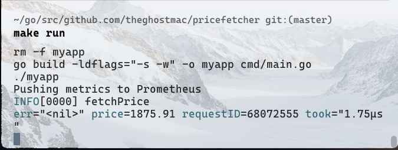

# Price Fetcher Microservice
pricefetcher is a microservice application that fetches the price of different cryptocurrencies in real-time. 
My main goal is to just use gRPC in development.

## Features
I'm trying out the following to remember stuff as I apply actively for jobs.
- JSON API
- GRPC
- Context

Crypto prices for 27th July 2023 used.

## Installation

1. Clone the repository: `git clone https://github.com/theghostmac/pricefetcher.git`
2. Change directory: `cd pricefetcher`
3. Install dependencies: `go mod download`

## Usage
Using Golang
1. Build the application: `go build -o myapp cmd/main.go`
2. Run the application: `./myapp`

Using Makefile to run the application:
```makefile
make run
```
Output:
```shell
curl -X GET "http://localhost:8080/?ticker=ETH"
{"ticker":"ETH","price":1875.91}
```


Using Makefile to build the application:
```makefile
make build
```
Clean up the binary after you finish:
```makefile
make clean
```

## Configuration

The project supports configuration via environment variables. You can customize the behavior by setting the following environment variables:

- `MYAPP_PORT`: Set the port number on which the application listens. Default is 8080.
- `MYAPP_DEBUG`: Set to "true" to enable debug mode. Default is "false".

## Contributing

We welcome contributions! If you'd like to contribute to the project, please follow these steps:

1. Fork the repository on GitHub.
2. Create a new branch for your feature or bug fix.
3. Make your changes and commit them.
4. Push your changes to your forked repository.
5. Submit a pull request to the main repository.
